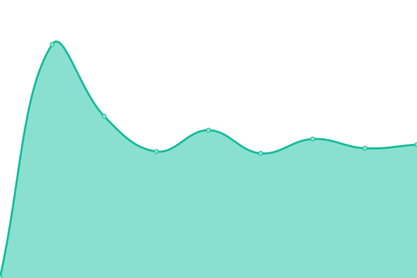
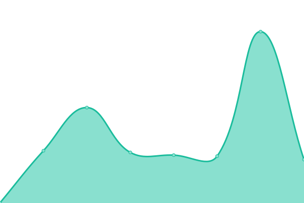
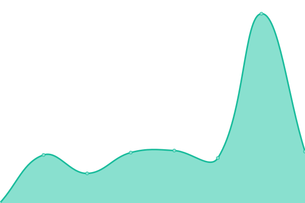

# [📈 Live Status](https://TwoThreeWang.github.io/upptime): <!--live status--> **🟩 All systems operational**

This repository contains the open-source uptime monitor and status page for [王图思睿](http://blog.error.work), powered by [Upptime](https://github.com/upptime/upptime).

With [Upptime](https://upptime.js.org), you can get your own unlimited and free uptime monitor and status page, powered entirely by a GitHub repository. We use [Issues](https://github.com/TwoThreeWang/upptime/issues) as incident reports, [Actions](https://github.com/TwoThreeWang/upptime/actions) as uptime monitors, and [Pages](https://TwoThreeWang.github.io/upptime) for the status page.

<!--start: status pages-->
<!-- This summary is generated by Upptime (https://github.com/upptime/upptime) -->
<!-- Do not edit this manually, your changes will be overwritten -->
<!-- prettier-ignore -->
| URL | Status | History | Response Time | Uptime |
| --- | ------ | ------- | ------------- | ------ |
|  [搜索引擎](https://error.work) | 🟩 Up | [.yml](https://github.com/TwoThreeWang/upptime/commits/HEAD/history/.yml) | 

 469ms
     
 | 

<a href="https://TwoThreeWang.github.io/upptime/history/">100.00%</a>
    

|  [电影搜索](https://v.error.work) | 🟩 Up | [.yml](https://github.com/TwoThreeWang/upptime/commits/HEAD/history/.yml) | 

 469ms
     
 | 

<a href="https://TwoThreeWang.github.io/upptime/history/">100.00%</a>
    

|  [博客](https://blog.error.work) | 🟩 Up | [.yml](https://github.com/TwoThreeWang/upptime/commits/HEAD/history/.yml) | 

 469ms
     
 | 

<a href="https://TwoThreeWang.github.io/upptime/history/">100.00%</a>
    

|  [公共API](https://api.error.work) | 🟩 Up | [api.yml](https://github.com/TwoThreeWang/upptime/commits/HEAD/history/api.yml) | 

 350ms
     
 | 

<a href="https://TwoThreeWang.github.io/upptime/history/api">100.00%</a>
    

|  [wiki](https://wiki.error.work) | 🟩 Up | [wiki.yml](https://github.com/TwoThreeWang/upptime/commits/HEAD/history/wiki.yml) | 

 177ms
     
 | 

<a href="https://TwoThreeWang.github.io/upptime/history/wiki">100.00%</a>
    

|  [chat](https://chat.error.work) | 🟩 Up | [chat.yml](https://github.com/TwoThreeWang/upptime/commits/HEAD/history/chat.yml) | 

 299ms
     
 | 

<a href="https://TwoThreeWang.github.io/upptime/history/chat">100.00%</a>
    

|  [talk](https://talk.error.work) | 🟩 Up | [talk.yml](https://github.com/TwoThreeWang/upptime/commits/HEAD/history/talk.yml) | 

 283ms
     
 | 

<a href="https://TwoThreeWang.github.io/upptime/history/talk">100.00%</a>
    

|  [Tools](https://tool.error.work) | 🟩 Up | [tools.yml](https://github.com/TwoThreeWang/upptime/commits/HEAD/history/tools.yml) | 

 336ms
     
 | 

<a href="https://TwoThreeWang.github.io/upptime/history/tools">100.00%</a>
    

<!--end: status pages-->

[**Visit our status website →**](https://TwoThreeWang.github.io/upptime)

## 📄 License

- Powered by: [Upptime](https://github.com/upptime/upptime)
- Code: [MIT](./LICENSE) © [王图思睿](http://blog.error.work)
- Data in the `./history` directory: [Open Database License](https://opendatacommons.org/licenses/odbl/1-0/)
